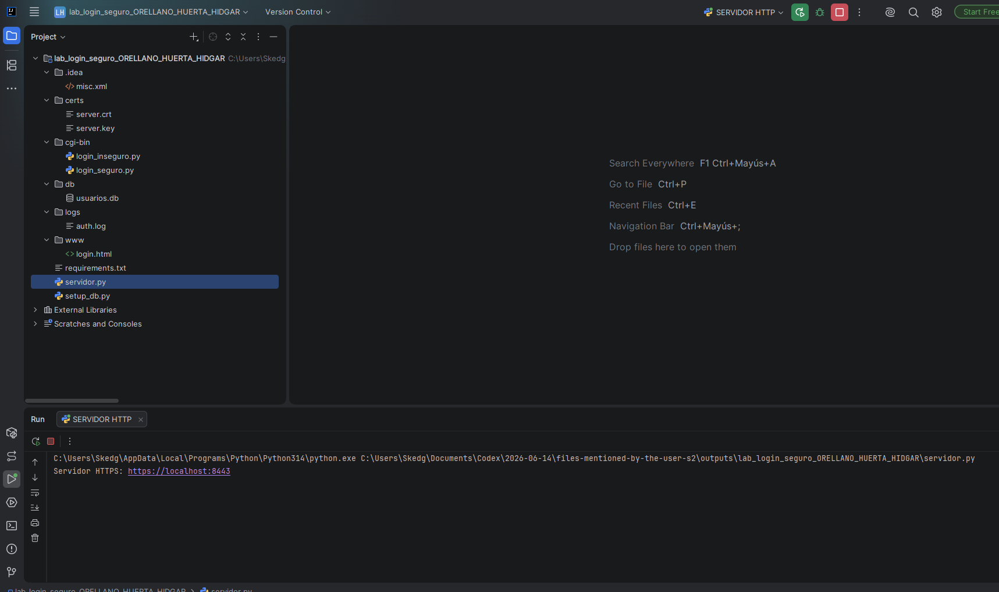
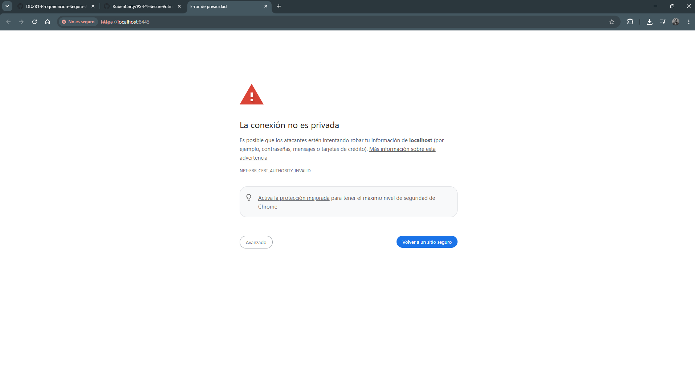
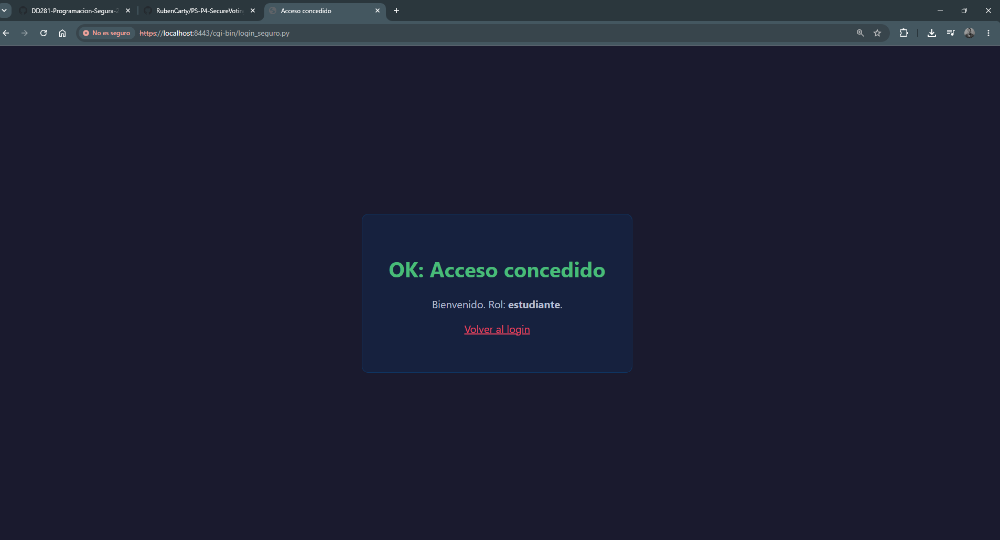
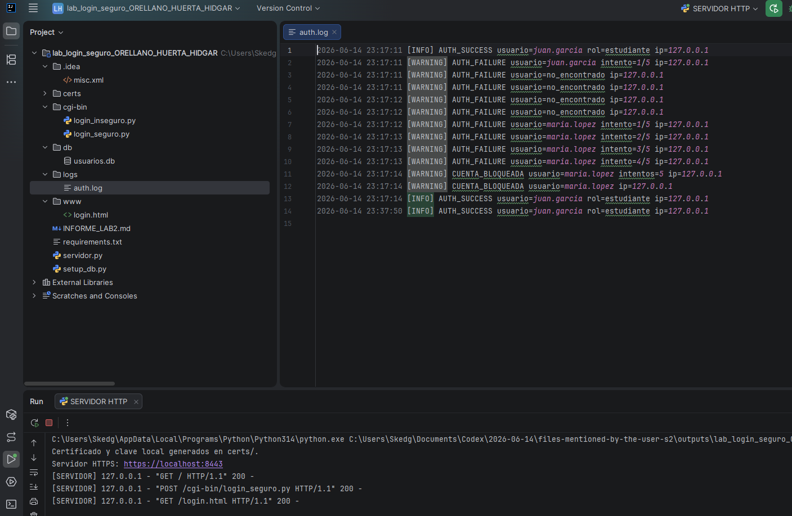

# INFORME DE LABORATORIO 2
## Implementación de login seguro con CGI y SSL

**Estudiante:** Orellano Huerta Hidgar  
**Grupo:** 4  
**Curso:** Programación Segura (DD281)  
**Fecha:** 15 de junio de 2026

## 1. Resumen ejecutivo

Se implementó un sistema local de autenticación sobre HTTPS con certificado
autofirmado para `localhost`. Las contraseñas se almacenaron con bcrypt y factor de
coste 12 en SQLite. El login seguro utiliza consultas parametrizadas, límites de
entrada, mensajes genéricos, escape HTML, bloqueo después de cinco fallos y logging
de seguridad. Se probaron credenciales válidas e inválidas, SQL Injection, XSS,
bloqueo temporal y headers HTTP. Todas las pruebas automatizadas finalizaron
correctamente.

### Estructura implementada

La siguiente captura muestra la estructura final del laboratorio y el servidor HTTPS
ejecutándose desde IntelliJ IDEA.

## 2. Certificado SSL

El certificado RSA de 2048 bits se generó para `CN=localhost`, con SAN para
`localhost` y `127.0.0.1`, y vigencia de 365 días. Es autofirmado, por lo que el
navegador advierte que la identidad no fue validada por una CA pública.

La advertencia `NET::ERR_CERT_AUTHORITY_INVALID` confirma que el certificado es
autofirmado y no fue emitido por una autoridad de certificación confiable para el
navegador.

## 3. Login exitoso

Prueba realizada con `juan.garcia` y `MiPassword123!`.

**Resultado:** acceso concedido con rol `estudiante`.

## 4. Log de autenticación

El archivo `logs/auth.log` contiene eventos `AUTH_SUCCESS`, `AUTH_FAILURE` y
`CUENTA_BLOQUEADA`, con fecha, resultado, usuario o indicador neutral, número de
intento e IP. No contiene contraseñas.

También se incluye el archivo de texto `logs/auth.log`.

## 5. Reflexiones

### Permisos de la clave

`chmod 600` limita lectura y escritura al propietario. `chmod 644` permitiría que
otros usuarios locales leyeran la clave privada.

### Common Name

El nombre del certificado debe coincidir con el host. Además de `CN=localhost`, se
incluyó `localhost` como Subject Alternative Name, que es la validación moderna.

### CSR

En producción se conserva solo si la política de auditoría o renovación lo requiere.
No contiene la clave privada, pero no debe publicarse sin necesidad.

### Coste bcrypt

La creación de cuatro usuarios tardó aproximadamente **0.762 segundos**. La demora
es intencional: reduce el número de contraseñas que un atacante puede probar.

## 6. Resultados de pruebas

| Prueba | Resultado |
|---|---|
| Login válido | Acceso concedido |
| Contraseña inválida | Mensaje genérico y contador |
| `' OR '1'='1` | Acceso denegado |
| `admin' --` | Acceso denegado |
| `'; DROP TABLE usuarios; --` | Acceso denegado; tabla intacta |
| XSS | No se ejecutó |
| Quinto fallo | Cuenta bloqueada durante 15 minutos |
| Clave correcta durante bloqueo | Acceso denegado |
| Headers | HSTS, `nosniff`, `DENY` y `no-store` presentes |

## 7. Comparación

| Aspecto | Script inseguro | Script seguro |
|---|---|---|
| SQL Injection | Concatena entradas | Consulta parametrizada |
| Contraseñas | Comparación directa | bcrypt coste 12 |
| Método HTTP | No valida | Solo POST |
| XSS | Refleja sin escape | Escape y CSP |
| Intentos | Sin límite | Cinco intentos y bloqueo |
| Logging | Ausente | Éxitos, fallos y bloqueos |
| Errores | Enumera usuarios | Mensaje genérico |
| Headers | Ausentes | Headers de endurecimiento |
| Timing | Diferencias observables | Verificación con hash dummy |

## 8. Vulnerabilidades del script inseguro

1. SQL Injection por concatenación.
2. Tratamiento incorrecto de contraseñas como texto plano.
3. XSS reflejado.
4. Exposición del registro y contraseña en la respuesta.
5. Enumeración de usuarios.
6. Ausencia de rate limiting, bloqueo y logging.
7. Falta de verificación del método y headers de seguridad.

## 9. Reflexión final

Para robustecer el sistema agregaría:

1. Sesiones reales con cookies `Secure`, `HttpOnly` y `SameSite`, rotación del ID y
   cierre del lado del servidor.
2. Token CSRF asociado a la sesión y validado con comparación de tiempo constante.
3. MFA, preferentemente WebAuthn/passkeys.
4. Rate limiting combinado por cuenta, IP y dispositivo para evitar abuso y bloqueo
   malicioso de cuentas.
5. Certificado emitido por una CA, gestor de secretos, monitoreo centralizado y
   alertas.

## 10. Nota de compatibilidad

Python marca CGI clásico como tecnología obsoleta y lo retiró de la biblioteca
estándar desde Python 3.13. El laboratorio conserva el modelo solicitado, pero el
servidor incluido ejecuta el script de forma controlada y compatible con Windows.
En producción se usaría un framework mantenido y un servidor WSGI/ASGI.
